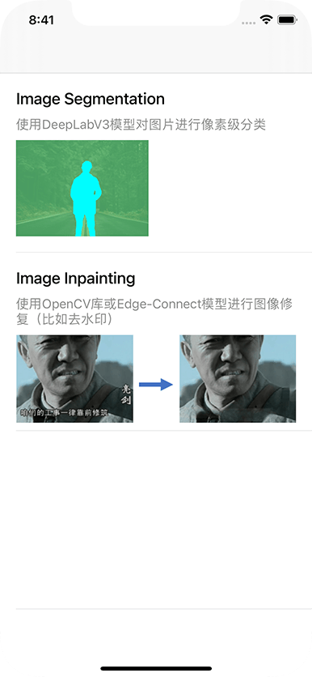
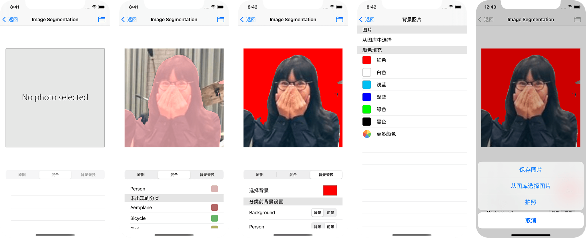
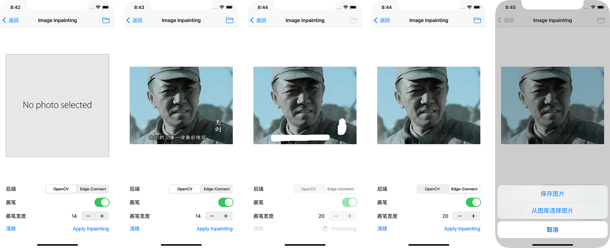
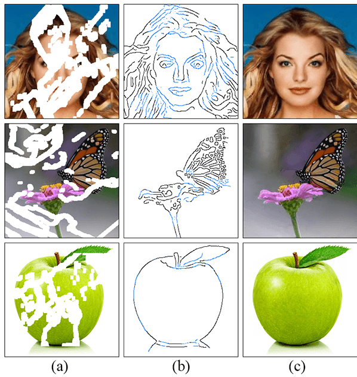

# IOS 20 大作业

缝合了以下两个功能（两者完全独立）



## Image Segmentation

使用 DeepLabV3 模型

mlmodel文件来自：https://developer.apple.com/machine-learning/models/

- 点击图片或右上角的按钮，在屏幕下方弹出菜单，可从图库或拍照来选择图片；如果当前有图片，可以选择"保存图片"来把当前显示的图片保存到图库

- 背景替换功能：用户可以指定各个分类是否作为背景，被置为背景的分类的像素会被替换，可选择图片或者纯色填充作为新的背景

- 可对图片进行缩放查看




## Image Inpainting

- 用户在图片上画出需要修复的区域，然后点击 "Apply Inpainting" 来应用图像修复

- OpenCV 为常规方法，执行速度快

- EdgeConnect 使用机器学习模型来完成，执行时间长（iPod touch 6 约 20 秒，simulator iPhone 12 Pro 约 6 秒）

- 可对图片进行缩放查看




### About EdgeConnect

原作 github 仓库：https://github.com/knazeri/edge-connect

mlmodel 文件来自：https://github.com/Ma-Dan/EdgeConnect-CoreML/tree/master/EdgeConnect-CoreML/EdgeConnect-CoreML/coreml_models

主要想法是先对边进行修复，然后再是颜色



其中第一步需要输入canny 边缘检测算法处理后的图像，为此引入了 OpenCV 库（原作使用 python 的 skimage 库，略有不同），顺带着加入了 OpenCV 的图像修复功能


> ### OpenCV
>
>  只使用到了 canny 和 inpaint 两个函数以及必要的数据结构转换，
>
>  编写代码时使用了完整的 OpenCV 库，占用空间大小达到了 400+MB；
>
>  上传时为了尽量减少 framework 的大小，用源码自行编译，尽量减去不需要的模块；
>
>  命令行选项尝试过只留用到的一两个模块，但要么构建 framework 报错，要么 xcode 报错；
>
>  最后折中构建出了 60MB 的 framework， 其使用以下命令完成构建：
>
>  ```
>  python opencv-4.5.1/platforms/ios/build_framework.py ios \
>  --disable-bitcode \
>  --iphoneos_archs arm64 \
>  --iphonesimulator_archs x86_64 \
>  --without calib3d \
>  --without features2d \
>  --without objdetect \
>  --without dnn \
>  --without ml \
>  --without flann \
>  --without stitching
>  ```
